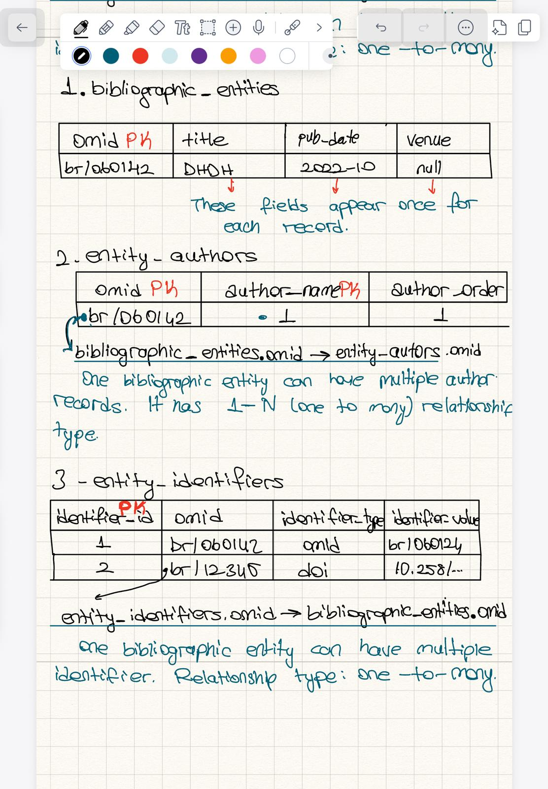

## Tables =D

1. `bibliographic_entities`
- `omid` TEXT PRIMARY KEY
- `title` TEXT
- `pub_date` TEXT
- `venue` TEXT

2. `entity_authors`
- `omid` TEXT NOT NULL
- `author_name` TEXT NOT NULL
- `author_order` INTEGER NOT NULL
- PRIMARY KEY (`omid`, `author_name`)
- FOREIGN KEY (`omid`) REFERENCES `bibliographic_entities`(`omid`)

3. `entity_identifiers`
- `identifier_id` INTEGER PRIMARY KEY AUTOINCREMENT
- `omid` TEXT NOT NULL
- `identifier_type` TEXT
- `identifier_value` TEXT NOT NULL
- UNIQUE (`omid`, `identifier_value`)
- FOREIGN KEY (`omid`) REFERENCES `bibliographic_entities`(`omid`)

## Why more than one table?

The JSON file is not fully flat:
- `author` is a list, so one work can have many authors.
- `id` is a list, so one work can have many identifiers.

That creates one-to-many relationships, which are modeled with separate tables in a relational database.

## Relationship summary

- One `bibliographic_entities` row can have many `entity_authors` rows.
- One `bibliographic_entities` row can have many `entity_identifiers` rows.

## Mapping from JSON

Example JSON fields:
- `title` -> `bibliographic_entities.title`
- `pub_date` -> `bibliographic_entities.pub_date`
- `venue` -> `bibliographic_entities.venue`
- `author[]` -> `entity_authors`
- `id[]` -> `entity_identifiers`

The `omid:br/...` identifier is used as the main key because citation data references bibliographic entities through OMID values.
